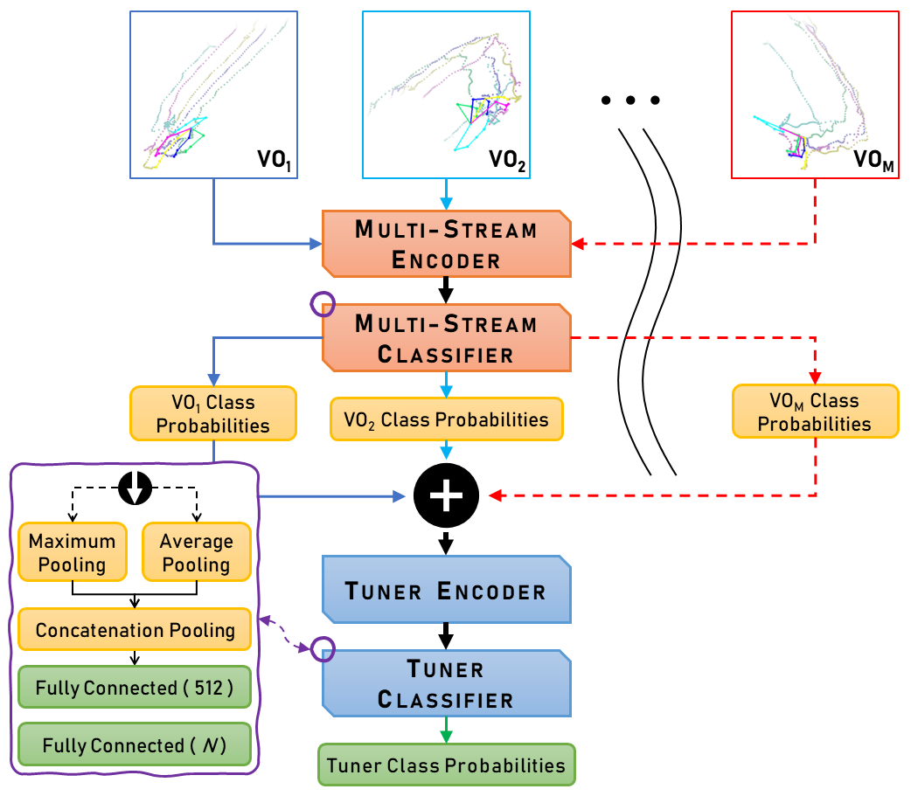

# e2eET Skeleton Based HGR Using Data-Level Fusion

This repository holds the PyTorch/FastAI implementation for **"Skeleton Based Hand Gesture Recognition Using Data Level Fusion"**.
Alternatively, this **[drive folder](https://drive.google.com/drive/folders/1BvoxkRDBK86A3_oNdQrnC8TLvp4l0W9x)** mirrors this repository but also contains the preprocessed .pckl files and generated .rar spatiotemporal datasets that are otherwise too large to be uploaded here.

The proposed hand gesture recognition (HGR) framework transforms the dynamic hand gesture recognition task into a static image classification task using data-level fusion and a custom ensemble tuner multi-stream CNN architecture.
For technical details, please refer to the following publication(s):

> **Development of a Lightweight Real-Time Application for Dynamic Hand Gesture Recognition** <br>
> *Oluwaleke Umar, Maki Habib* &mdash; [[IEEE ICMA Conference Paper](https://ieeexplore.ieee.org/document/10216066)]
>

A real-time HGR application developed based on our framework only requires video streams from any standard inbuilt PC webcam and operates with a minimal CPU and RAM footprint as shown in [`./images/application-memory-utilization.png`](./images/application-memory-utilization.png).
The application underscores the utility of our proposed framework for reducing the hardware requirements and computational complexity of the HGR task on a standard PC while achieving acceptable latency, frames-per-second, and classification accuracy.

<p align="center">
  
</p>


## Prerequisites

- Python == 3.8.5
- Vispy == 0.9.3
- PyTorch == 1.8.1+cu102
- FastAI == 2.5.3
- MediaPipe == 0.8.7.1
- Other dependencies described in requirements.txt


## Data-Level Fusion: Processing Benchmark Datasets

1. **3D Hand Gesture Recognition Using a Depth and Skeleton Dataset (SHREC2017)**
   - Download the [SHREC2017 dataset](http://www-rech.telecom-lille.fr/shrec2017-hand/) and extract to the directory `./datasets/SHREC2017/`.
   - Preprocess the dataset by running the notebook `./modules/parse-data-SHREC2017d.ipynb`. This will create a file `./datasets/SHREC2017_3d_dictTVS_l250_s2800.pckl`.
   - To generate the 14G and 28G spatiotemporal datasets:
      - Modify line 23 in `./modules/.configs/shrec2017-v5-default.hgr-config` such that `"n_dataset_classes": 14,` for 14G evaluation mode or `"n_dataset_classes": 28,` for 28G evaluation mode.
      - Execute `python modules/create_imgs_v5_SHREC2017d_mVOs.py -c "modules/.configs/shrec2017-v5-default.hgr-config"`.
   -  The 14G and 28G spatiotemporal datasets will be saved to `./images_d/SHREC2017.mVOs-3d.14g-noisy(raw).960px-[allVOs].adaptive-mean` and `./images_d/SHREC2017.mVOs-3d.28g-noisy(raw).960px-[allVOs].adaptive-mean` respectively.

2. **Dynamic Hand Gesture 14/28 (DHG1428) Dataset**
   - Download the [DHG1428 dataset](http://www-rech.telecom-lille.fr/DHGdataset/) and extract to the directory `./datasets/DHG1428/`.
   - Preprocess the dataset by running the notebook `./modules/parse-data-DHG1428d.ipynb`. This will create a file `./datasets/DHG1428_3d_dictTVS_l250_s2800.pckl`.
   - To generate the 14G and 28G spatiotemporal datasets:
      - Modify line 23 in `./modules/.configs/dhg1428-v5-default.hgr-config` such that `"n_dataset_classes": 14,` for 14G evaluation mode or `"n_dataset_classes": 28,` for 28G evaluation mode.
      - Execute `python modules/create_imgs_v5_DHG1428d_mVOs.py -c "modules/.configs/dhg1428-v5-default.hgr-config""`.
   -  The 14G and 28G spatiotemporal datasets will be saved to `./images_d/DHG1428.mVOs-3d.14g-noisy(raw).960px-[allVOs].adaptive-mean` and `./images_d/DHG1428.mVOs-3d.28g-noisy(raw).960px-[allVOs].adaptive-mean` respectively.


*NOTE: The parameters required to generate the spatiotemporal datasets are set in the `*.hgr-config` files. See `./modules/.configs/all-HGR-ds-schemas.json` for details about the parameters.*

> **Alternatively, the preprocessed .pckl files and generated spatiotemporal datasets can be downloaded from this [drive folder](https://drive.google.com/drive/folders/1BvoxkRDBK86A3_oNdQrnC8TLvp4l0W9x) and extracted to the corresponding `./datasets` and `./images_d` directories.**


## Model Training & Evaluation


### Single-Stream (1SA) & Two-Stream (2SA) Experiments

`./experiments.server/sVO.mVO.Checkpoints.py` contains the code for testing the effect of different view orientations in the spatiotemporal datasets generated on classification accuracy of different datasets.

The notebook `./experiments.server/sVO.mVO.Checkpoints.ipynb` contains the necessary command line inputs while `./experiments.server/sVO.mVO.Checkpoints.yml` contains the results of extensive 1SA and 2SA experiments for all datasets.
The results of any experiments run will automatically be appended to that file. The TensorBoard event logs can be found in `./runs.server/sVO.mVO.Checkpoints.zip`.

**EX1 &ndash;**
1SA experiment on `DHG1428` with `14` classes using `top-down` view orientation running on GPU `0`:
```bash
python sVO.mVO.Checkpoints.py -IG 0 -nC 14 -mVOs top-down -dsN DHG1428
```

**EX2 &ndash;**
2SA experiment on `DHG1428` with `28` classes using `custom` and `side-left` view orientations (order-sensitive) running on GPU `1`:
```bash
python sVO.mVO.Checkpoints.py -IG 1 -nC 28 -mVOs custom side-left -dsN DHG1428
```

### Multi-Stream Ensemble Tuner Experiments

`./experiments.server/mVO.e2eEnsembleTuning.py` contains the code for training the spatiotemporal datasets using the custom Ensemble Tuner Multi-Stream CNN Architecture shown in the figure above.

The notebook `./experiments.server/mVO.e2eEnsembleTuning.ipynb` contains the necessary command line inputs while `./experiments.server/mVO.e2eEnsembleTuning.yml` contains the results of extensive 1SA, 2SA and 3SA experiments to find the optimal combination and ordering of mVOs for all datasets.
The results of any experiments run will automatically be appended to that file. The TensorBoard event logs can be found in `./runs.server/mVO.e2eEnsembleTuning.zip`.

**EX &ndash;**
3SA experiment on `DHG1428` with `14` classes using `top-down`, `custom` and `front-away` view orientation running on GPU `0`:
```bash
python mVO.e2eEnsembleTuning.py -IG 0 -nC 14 -mVOs top-down custom front-away -dsN DHG1428 -IISE 0 -ISIS 0
```

### Final Evaluation on Benchmark Datasets

The final evaluation for each benchmark dataset was carried out with the optimal combination and ordering of mVOs, along with training schedules.
The files `./experiments.server/allDatasets-e2eEnsembleTuning-Summary.xlsx` and `./experiments.server/allDatasets-e2eEnsembleTuning-Summary.yml` summarize how the final classification accuracies were obtained.

To reproduce the evaluation results reported in the paper, the notebook `./experiments.server/allDatasets-e2eEnsembleTuning-Evaluation.ipynb` contains the necessary command line inputs while `./experiments.server/allDatasets-e2eEnsembleTuning-Evaluation.yml` contains the evaluation results.
The TensorBoard event logs can be found in `./runs.server/allDatasets-e2eEnsembleTuning-Evaluation.zip`.

<!-- ˄˅↑↓ -->
| Benchmark Dataset | Classification Accuracy (%) |
| ----------------- | :-------------------------: |
| CNR               | 97.05 <sub>**↓1.73**</sub>  |
| LMDHG             | 98.97 <sub>**↑5.16**</sub>  |
| FPHA              | 91.83 <sub>**↓4.10**</sub>  |
| SHREC2017 (14G)   | 97.86 <sub>**↑0.24**</sub>  |
| SHREC2017 (28G)   | 95.36 <sub>**↓0.47**</sub>  |
| DHG1428 (14G)     | 95.83 <sub>**↓2.27**</sub>  |
| DHG1428 (28G)     | 92.38 <sub>**↓1.82**</sub>  |
| SBUKID            | 93.96 <sub>**↓4.34**</sub>  |
<!-- ˄˅↑↓ -->


## Citation

If you find this work contained in this repository useful in your research, please cite the following publication(s) as relevant:

```bibtex
@INPROCEEDINGS{10216066,
  author={Yusuf, Oluwaleke and Habib, Maki},
  booktitle={2023 IEEE International Conference on Mechatronics and Automation (ICMA)},
  title={Development of a Lightweight Real-Time Application for Dynamic Hand Gesture Recognition},
  year={2023},
  pages={543-548},
  doi={10.1109/ICMA57826.2023.10216066}}

```

```bibtex
@incollection{
   author = {Yusuf, Oluwaleke Umar and Habib, Maki K. and Moustafa, Mohamed N.},
   title = {Transforming Hand Gesture Recognition Into Image Classification Using Data Level Fusion: Methods, Framework, and Results},
   booktitle = {Global Perspectives on Robotics and Autonomous Systems: Development and Applications},
   editor = {Habib, Maki K.},
   pages = {39--78},
   publisher = {IGI Global},
   year = {2023},
   doi = {10.4018/978-1-6684-7791-5.ch003},
}
```

## Contact

For any questions, feel free to contact: `oluwaleke(dot)umar(at)aucegypt(dot)edu`

<hr>
